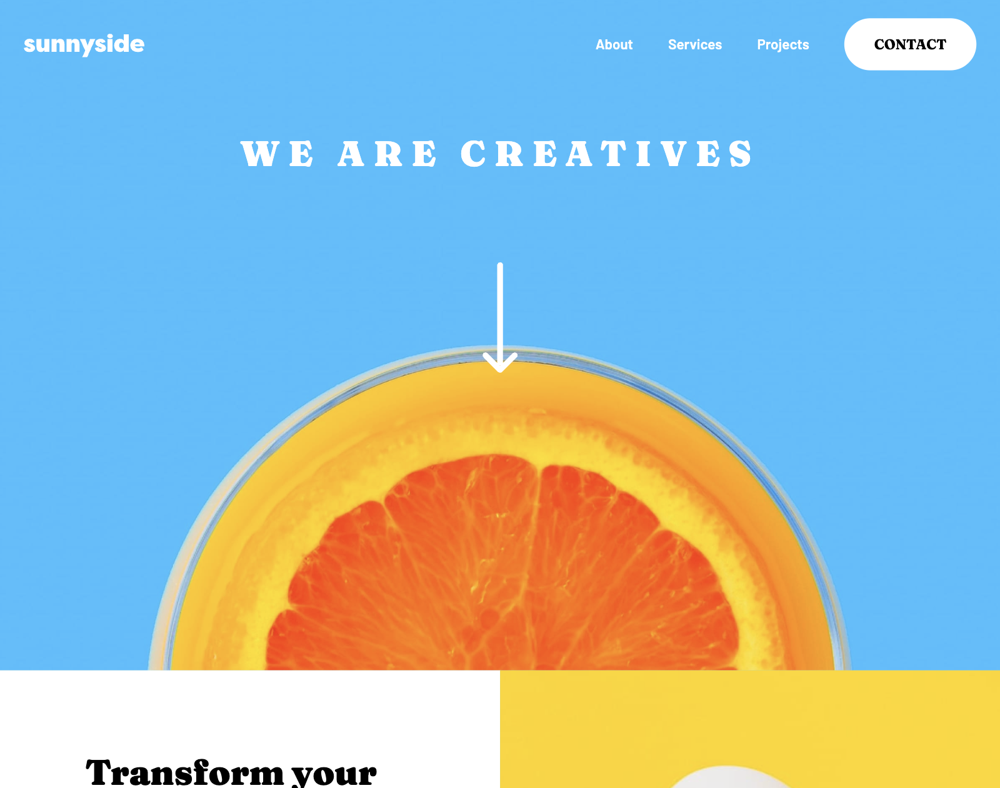

# Frontend Mentor - Sunnyside agency landing page solution

This is a solution to the [Sunnyside agency landing page challenge on Frontend Mentor](https://www.frontendmentor.io/challenges/agency-landing-page-7yVs3B6ef). Frontend Mentor challenges help you improve your coding skills by building realistic projects.

## Table of contents

- [Overview](#overview)
  - [The challenge](#the-challenge)
  - [Screenshot](#screenshot)
  - [Links](#links)
- [My process](#my-process)
  - [Built with](#built-with)
  - [What I learned](#what-i-learned)
  - [Continued development](#continued-development)
  - [AI Collaboration](#ai-collaboration)
- [Author](#author)

## Overview

### The challenge

Users should be able to:

- View the optimal layout for the site depending on their device's screen size
- See hover states for all interactive elements on the page

### Screenshot



### Links

[Live Site URL](https://dana-challenge3.netlify.app)

## My process

### Built with

- HTML5
- SCSS
- CSS Flexbox
- CSS Grid
- Mobile-first workflow

### What I learned

- I learned how small CSS decisions, such as ```fit-content```, fixed widths, or inconsistent padding, can have large effects on layout, especially when combined with responsive behavior.
- I gained a better understanding of CSS specificity and how state-based classes like ```.active``` can unintentionally override styles across breakpoints if not properly scoped. 
- I improved my debugging process by using Chrome DevTools more effectively and making small, incremental changes rather than trying to fix everything at once. 

### Continued development

- I aim to continue improving how I plan my layouts before starting to write code, especially by establishing more consistent patterns for spacing, containers, and responsiveness. Doing so would allow me to become more efficient at debugging by quickly identifying whether an issue is related to layout vs. sizing vs. specificity, instead of spending time testing unrelated fixes.
- I'd like to focus on writing cleaner and more maintainable CSS by reducing duplication, especially in sections that share similar structures. 

### AI Collaboration

- I used AI for this project as a tool to help identify and debug issues when I was stuck on layout problems that weren't immediately obvious. It helped point out patterns and potential causes that I hadn't considered myself. 
- Through using AI, I learned the importance of critically evaluating its suggestions. Not every solution worked directly, so I had to adapt the advice to fit my specific code and understand why certain fixes were not effective.

## Author

- [Portfolio](http://danajeon.netlify.app/)
- [Frontend Mentor](https://www.frontendmentor.io/profile/danajeon)
- [LinkedIn](https://linkedin.com/in/dana-jeon-dev)
- [GitHub](https://github.com/danajeon)